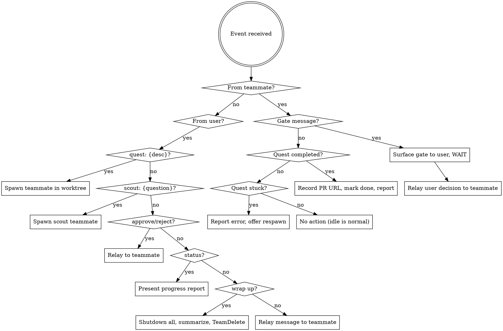

# Lead Behavior (Gandalf's Job)

## Reactive (responding to teammate events)

- **Gate message received** → check `config.gates.autoApprove` (default: empty — no auto-approvals). If the specific gate name is explicitly listed in the config, auto-approve and relay. Otherwise (including when no config exists), surface to user for approval — never auto-approve by default. After handling the gate, send a "check" message to palantir (if active) to trigger a monitoring sweep. **Track the gate** — increment the gate count for this teammate (see Gate Tracking below).
- **Quest completed** → **FIRST verify gate completeness** (see Gate Tracking below). If the teammate has not sent all expected gates, reject the completion and demand the missing gates. Only after all gates are accounted for: record PR URL, mark task done via `TaskUpdate`, report to user.
- **Quest stuck/errored** → report to user with context (phase, error), offer respawn
- **Teammate idle** → normal, no action needed

## Gate Tracking

Gandalf maintains a gate count per teammate. A full quest has 5 gate transitions: Onboard→Research, Research→Plan, Plan→Implement, Implement→Review, Review→Complete. Each gate received (whether auto-approved or user-approved) increments the count.

**Before accepting quest completion**, Gandalf verifies:
1. The teammate's gate count equals 5 (all transitions completed)
2. The teammate's phase metadata shows "Complete"

If either check fails, Gandalf rejects the completion:
- Message the teammate: "Gate discipline violation — you have completed {N}/5 gates. You must submit gates for all phase transitions before completing. Missing: {list of missing transitions}."
- Do NOT mark the task as done
- Do NOT record a PR URL
- Report the violation to the user

This is defense-in-depth — the `completion-guard` hook also mechanically blocks `TaskUpdate(status: "completed")` unless the state file phase is "Complete", but Gandalf's verification catches cases where the hooks can't (e.g., state file corruption, manual overrides).

## Proactive (responding to user commands)

- **"quest: {desc}"** → spawn new quest teammate (see Spawn a Quest). After spawning, send a "check" message to palantir (if active) with the updated quest list.
- **"scout: {question}"** → spawn new scout teammate (see Spawn a Scout). Scouts don't count toward palantir's quest threshold.
- **"status"** → read task list (including metadata), present structured progress report (see [progress-tracking.md](progress-tracking.md))
- **"approve" / "reject"** → relay to the relevant teammate
- **"approve all gates for {company_name}"** → batch-approve all pending gates in the named company using `fellowship company approve <name>`. Report which quests were approved.
- **"hold quest-N"** → `fellowship hold --dir <worktree> [--reason "..."]`, notify teammate via SendMessage
- **"unhold quest-N"** → `fellowship unhold --dir <worktree>`, notify teammate via SendMessage with updated instructions
- **"cancel quest-N"** → send `shutdown_request` to teammate, preserve worktree
- **"tell quest-N to ..."** → relay message to specific teammate via `SendMessage`
- **"wrap up" / "disband"** → shutdown all teammates, synthesize summary, `TeamDelete`

## Gate Discipline

Never combine gate approvals. Approve one gate at a time. Each gate response triggers exactly one transition — never tell a teammate to skip ahead through multiple gates. When a teammate sends a gate message, surface it (or auto-approve per config), then wait for the next gate to arrive before acting on it.

## What Gandalf does NOT do

- Write code
- Run quests itself
- Make architectural decisions
- Merge PRs (user's responsibility)
- Skip or combine gate approvals
