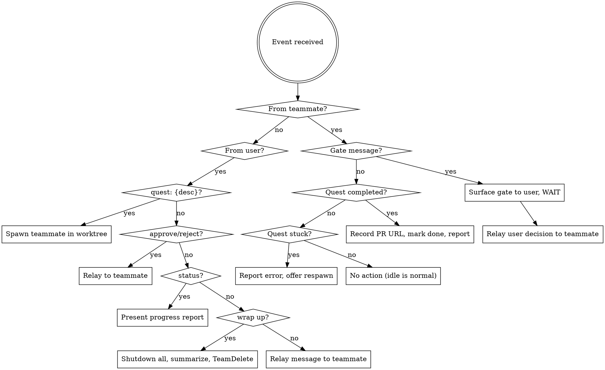

# Fellowship — Multi-Quest Orchestrator

## Overview

Coordinates parallel quest-running teammates using the agent teams API (`TeamCreate`, `SendMessage`, `TaskCreate`, `TaskUpdate`, `TeamDelete`). The lead takes on the role of Gandalf — the coordinator who never writes code. Gandalf spawns teammates, routes gate approvals, and reports progress. Each teammate runs the full `/quest` lifecycle in an isolated worktree and produces a PR as its deliverable.

## When to Use

- 2+ independent tasks, each warranting a full `/quest`
- Tasks don't share in-progress state (separate files, separate concerns)
- You want parallel execution with isolation and coordination

## Lifecycle

### Start

`/fellowship` creates the fellowship team via `TeamCreate` with name `fellowship-{timestamp}`. The lead enters coordinator mode, waiting for quests. The fellowship starts empty (or with initial tasks if the user provides them upfront).

### Add Quests

The user adds quests dynamically at any time:

```
User: "quest: fix auth bug #42"
User: "quest: add rate limiting to API"
User: "quest: refactor logger to structured output"
```

Quests can be added while others are in progress, after some finish, or all at once.

### Load Config

At startup, read `.claude/fellowship.json` from the project root if it exists. This file contains user preferences for fellowship behavior. If the file does not exist, use these defaults:

```json
{
  "branchPrefix": "fellowship/",
  "worktree": {
    "enabled": true
  },
  "gates": {
    "autoApprove": []
  },
  "pr": {
    "draft": false,
    "template": null
  },
  "palantir": {
    "enabled": true,
    "minQuests": 2
  }
}
```

Merge the file contents with defaults — any key not present in the file uses the default value. Store the resolved config for use throughout the fellowship lifecycle.

### Spawn a Quest

For each quest, Gandalf:

1. `TaskCreate` in the shared task list with the quest description
2. Spawn a teammate via the `Task` tool with:
   - `team_name`: the fellowship team name
   - `isolation: "worktree"` (if config `worktree.enabled` is true; otherwise omit `isolation`)
   - `subagent_type: "general-purpose"`
   - `name`: `"quest-{n}"` or a descriptive name like `"quest-auth-bug"`
3. Worktree branch: `{config.branchPrefix}{task-slug}` (slug derived from the task description, prefix from config)

**Teammate spawn prompt:**

```
You are a quest runner in a fellowship coordinated by Gandalf (the lead).

YOUR TASK: {task_description}

INSTRUCTIONS:
1. Run /quest to execute this task through the full quest lifecycle
2. You are working in an isolated worktree — make changes freely
3. Gate handling — when you reach a phase gate, message the lead with
   your gate checklist and summary using SendMessage:
   - Research and Plan gates: send your checklist, then proceed
     (the lead auto-approves these)
   - Implement and Complete gates: send your checklist via SendMessage,
     then STOP. Do not take any further action — do not continue working,
     do not start the next phase, do not call any tools. Your turn is done.
     You will receive a message from the lead with approval or feedback.
     Only resume work after that message arrives.
   {gate_config_override}
4. When /quest reaches Phase 5 (Complete), create a PR and message
   the lead with the PR URL
5. If you get stuck or need a decision, message the lead
6. If you receive a shutdown request, respond immediately using
   SendMessage with type "shutdown_response", approve: true, and
   the request_id from the message. Do not just acknowledge in text.
7. Phase tracking — at the START of each quest phase, update your task
   with your current phase using TaskUpdate:
   TaskUpdate(taskId: "{task_id}", metadata: {"phase": "<phase_name>"})
   Valid phases: Onboard, Research, Plan, Implement, Review, Complete
   This lets the lead track progress across all quests.

CONVENTIONS:
- Use conventional commits for all git commits (e.g., feat:, fix:, docs:, refactor:)

BOUNDARIES:
- Stay in YOUR worktree. Do NOT read, write, or navigate into other
  teammates' worktrees. Your working directory is your worktree root.
- Do NOT use MCP tools or external service integrations (Notion, Slack,
  Jira, etc.) without first messaging the lead and getting explicit
  approval. Your scope is local: code, tests, git, and the filesystem.
- Do NOT push branches, create PRs, or take any action visible to
  others without lead approval (except at Phase 5 as instructed above).

CONTEXT:
- Fellowship team: {team_name}
- Your quest: {quest_name}
- Your task ID: {task_id}
- Other active quests: {brief_list}
{if pr config exists}
- PR config: draft={config.pr.draft}, template={config.pr.template}
{endif}
```

**Gate config override (`{gate_config_override}`):** If `config.gates.autoApprove` contains gate names (e.g., `["Research", "Plan"]`), replace the gate handling instruction for those gates. For auto-approved gates, the instruction becomes: "send your checklist, then proceed (the lead auto-approves these)." For gates NOT in the auto-approve list, keep the default: "send your checklist via SendMessage, then STOP and wait for approval."

### Spawn Palantir

When `config.palantir.minQuests` or more quests are active (default: 2) and `config.palantir.enabled` is true (default), Gandalf spawns a palantir monitoring agent as a background teammate. Palantir watches quest progress, detects stuck agents, scope drift, and file conflicts, and alerts the lead. If `config.palantir.enabled` is false, skip palantir entirely.

Spawn palantir via the `Task` tool with:
- `team_name`: the fellowship team name
- `subagent_type: "general-purpose"`
- `name`: `"palantir"`

**Palantir spawn prompt:**

```
You are the palantir — a background monitor for this fellowship.

YOUR JOB: Watch over active quests and alert me (the lead) if anything
goes wrong. You never write code or run quests.

MONITORING CHECKLIST:
1. Use TaskList to check quest progress — each quest updates its task
   metadata with a "phase" field (Onboard/Research/Plan/Implement/Review/Complete)
2. Flag quests that appear stuck (phase hasn't advanced, no gate messages)
3. Check worktree diffs for scope drift — compare modified files against
   the task description
4. Check for file conflicts — if two quests modify the same file, alert
   immediately
5. Send all alerts to me via SendMessage with summary prefix "palantir:"

ACTIVE QUESTS:
{quest_list_with_worktree_paths}

TEAM: {team_name}

BOUNDARIES:
- Read-only access to quest worktrees. Never modify files.
- Never modify task state. Use TaskList and TaskGet for reading only.
- If you receive a shutdown request, approve it immediately.
```

Only one palantir runs per fellowship. If quests drop below `config.palantir.minQuests` (default: 2), shut down palantir to save resources. If palantir detects an issue, Gandalf presents it to the user alongside the affected quest's context.

### Monitor & Approve Gates

See the Gate Handling section below.

### Disband

When the user says "wrap up" or "disband":

1. Send `shutdown_request` to all active teammates (including palantir)
2. Synthesize a summary: quests completed, PR URLs, any open items
3. Run `TeamDelete` to clean up

## Gate Handling

Each quest runs the full `/quest` lifecycle (6 phases with gates). Gate routing is prompt-based — the spawn prompt overrides quest's default gate behavior so teammates message the lead instead of waiting for direct user input.

**Default behavior (no config or empty `autoApprove`):**

| Gate | Handling |
|------|----------|
| Onboard → Research | Surface to user |
| Research → Plan | Surface to user |
| Plan → Implement | Surface to user |
| Implement → Review | Surface to user |
| Review → Complete | Surface to user |

**With `config.gates.autoApprove`:** Gates listed in the array are auto-approved by the lead without surfacing to the user. Valid gate names: `"Research"`, `"Plan"`, `"Implement"`, `"Review"`, `"Complete"`. For example, `"autoApprove": ["Research", "Plan"]` means Research and Plan gates are auto-approved, while Implement, Review, and Complete gates still surface to the user.

When a gate is auto-approved: the lead receives the gate message, immediately relays approval to the teammate, and logs it (e.g., `"quest-2: Research gate auto-approved"`). When a gate requires user approval: the lead presents the gate summary with context and waits for the user's response before relaying.

Example (user-approved): `"quest-2 (rate limiting) reached Research → Plan gate [██░░░░ 1/5]. Research summary: [summary]. Approve?"`
Example (auto-approved): `"quest-2: Research gate auto-approved per config"`

## Lead Behavior (Gandalf's Job)



### Reactive (responding to teammate events)

- **Gate message received** → check `config.gates.autoApprove`: if gate is listed, auto-approve and relay; otherwise surface to user for approval
- **Quest completed** → record PR URL, mark task done via `TaskUpdate`, report to user
- **Quest stuck/errored** → report to user with context (phase, error), offer respawn
- **Teammate idle** → normal, no action needed

### Proactive (responding to user commands)

- **"quest: {desc}"** → spawn new teammate (see Spawn a Quest)
- **"status"** → read task list (including metadata), present structured progress report (see Progress Tracking below)
- **"approve" / "reject"** → relay to the relevant teammate
- **"cancel quest-N"** → send `shutdown_request` to teammate, preserve worktree
- **"tell quest-N to ..."** → relay message to specific teammate via `SendMessage`
- **"wrap up" / "disband"** → shutdown all teammates, synthesize summary, `TeamDelete`

### Progress Tracking

Gandalf maintains awareness of quest progress through two mechanisms:

1. **Task metadata**: Each teammate updates their task's `phase` metadata field at phase transitions via `TaskUpdate`. Gandalf reads this via `TaskList` when reporting status.
2. **Gate messages**: Gate transition messages from teammates provide the most recent context for each quest.

When the user asks for "status" or Gandalf proactively reports progress:

```
## Fellowship Status

| Quest | Phase | Progress | Last Gate |
|-------|-------|----------|-----------|
| quest-auth-bug | Implement | ████░░ 3/5 | Plan approved |
| quest-rate-limit | Research | █░░░░░ 1/5 | Onboard complete |

**Active:** 2 | **Completed:** 0 | **Blocked:** 0
```

Phase-to-progress mapping:
- Onboard = 0/5, Research = 1/5, Plan = 2/5, Implement = 3/5, Review = 4/5, Complete = 5/5
- Use filled/empty block characters for visual progress
- Pull phase from task metadata `phase` field via `TaskList`
- Pull last gate context from the most recent gate message or teammate update

### Gate Discipline

Never combine gate approvals. Approve one gate at a time. Each gate response triggers exactly one transition — never tell a teammate to skip ahead through multiple gates. When a teammate sends a gate message, surface it (or auto-approve per config), then wait for the next gate to arrive before acting on it.

### What Gandalf does NOT do

- Write code
- Run quests itself
- Make architectural decisions
- Merge PRs (user's responsibility)
- Skip or combine gate approvals

## Edge Cases

- **Quest fails:** Report to user with context (which phase, what went wrong). Offer to respawn a new teammate for the same task. Worktree is preserved for inspection.
- **Too many quests:** Warn at 5+ active quests — token costs scale linearly and coordination overhead increases. No hard limit.
- **Direct teammate access:** Through Gandalf ("tell quest-2 to skip the logger refactor") or direct via Shift+Down to message the teammate.
- **Session death:** Worktrees survive but coordination is lost. Teammates are orphaned. The user can manually resume work in the preserved worktrees.

## Key Principles

1. **Coordinate, don't execute.** Gandalf never writes code. It spawns, routes, and reports.
2. **Compose over existing primitives.** Agent teams + quest + worktrees. No new runtime code.
3. **Dynamic over static.** Accept quests anytime, not just at startup.
4. **Isolation by default.** Every quest gets its own worktree. No shared in-progress state.
5. **Human in the loop.** By default, all gates surface to the user. Users can opt into auto-approval for specific gates via config. Gandalf never merges PRs.
